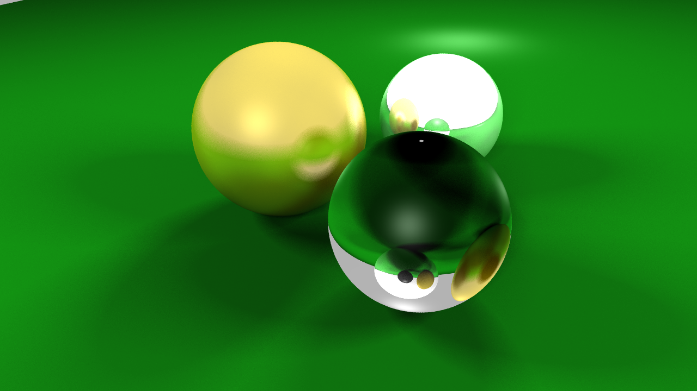
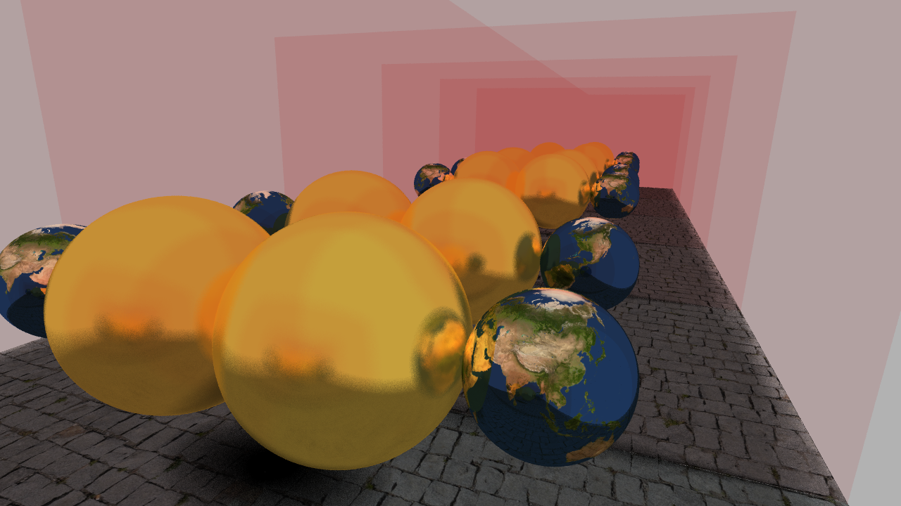
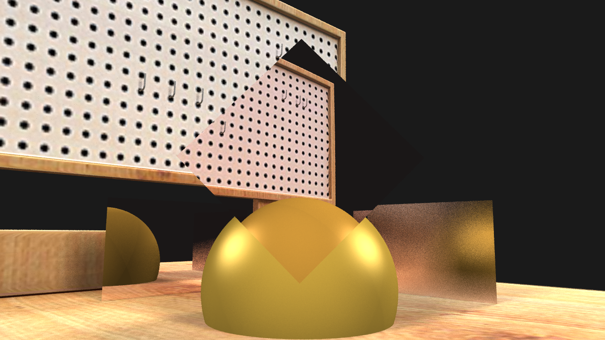
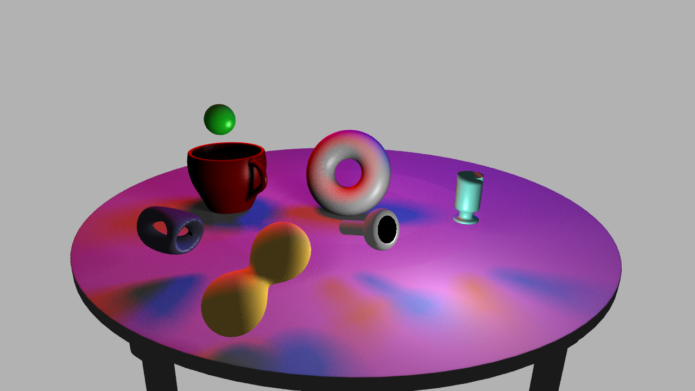

# 레이트레이싱

그래픽스 강의 마지막 과제 결과물입니다. 한 학기 동안 배운 여러 내용과 과제 결과물을 기반으로 레이트레이서를 작성하였습니다. 때문에 한 학기 동안 그래픽스 강의를 들으며 학습한 여러 내용들을 재차 확인할 수 있었습니다. 또한 최적화를 위해 조사해보며 KD tree, Octree, bsp와 같은 공간분할 방법들을 익혀볼 수 있었습니다.

#### 주요기능

- BVH for acceleration
- backward ray tracing
  - reflection
  - refraction
  - shadow
  - distributed raytracing
    - multisampling
    - soft shadow
    - rough mirror

- .obj file import
- scene import & viewer
  - swept surface
    - spline curve and bezier curve
- phong illumination
- multicore support

#### Result

- marbles

- mirror

- workbench

- Etc...

